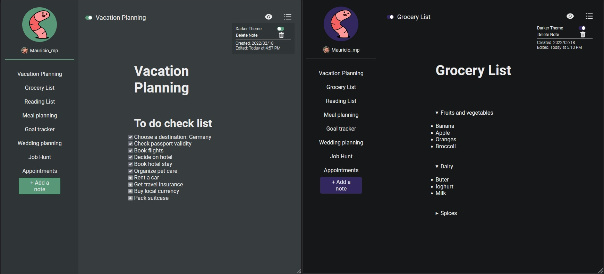

<h1 align="center">Worm Notes</h1>
Aplicação em React que permite criar e editar notas. Busquei inpiração no App Ideas e cobri as seguintes funcionalidades:

<h4> Principais do app-ideas </h4>

- [x] Criar, editar e deletar notas 

<h4> Adicionais </h4>

- [x] Tema Light e Dark 
- [x] Responsividade com mobile 
- [x] Login com google 
- [x] Banco de dados do Firebase
- [x] Data que a nota foi criada e modificada 
- [x] Visualizar em Markdown 

<a>

</a>

Esse projeto foi desenvolvido com as seguintes tecnologias:
- [React](https://reactjs.org)
- [Firebase](https://firebase.google.com/)
- [TypeScript](https://www.typescriptlang.org/)

Clone o projeto e acesse a pasta.

```bash
$ git clone https://github.com/mujapira/WormNotes.git
$ cd WormNotesOfc
```

Para iniciá-lo, siga os passos abaixo:
```bash
# Instalar as dependências
$ yarn
# Iniciar o projeto
$ yarn start
```
O app estará disponível no seu browser pelo endereço http://localhost:3000.

Lembrando que será necessário criar uma conta no [Firebase](https://firebase.google.com/) e um projeto para disponibilizar um Realtime Database. É de suma importância que se crie um arquivo .env.local a fim de realizar a comunicação com o Real Time Database.
```
REACT_APP_API_KEY= preencher com dados do firebase
REACT_APP_AUTH_DOMAIN= preencher com dados do firebase
REACT_APP_DATABASE_URL= preencher com dados do firebase
REACT_APP_PROCT_ID= preencher com dados do firebase
REACT_APP_STORAGE_BUCKET= preencher com dados do firebase
REACT_APP_MESSAGING_SENDER_ID= preencher com dados do firebase
REACT_APP_APP_ID= preencher com dados do firebase
```

<p>Acesse o link para ver o projeto online! https://</p>

<p>Guia para Markdown https://www.markdownguide.org/basic-syntax/</p>

Link do app-ideas https://github.com/florinpop17/app-ideas/blob/master/Projects/1-Beginner/Notes-App.md
